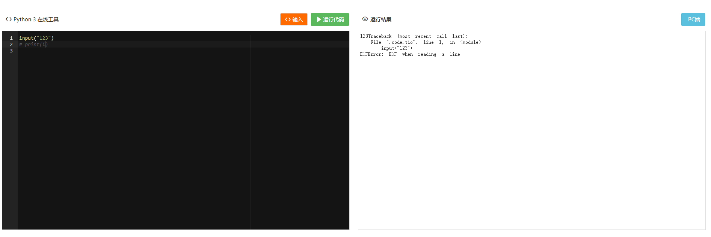
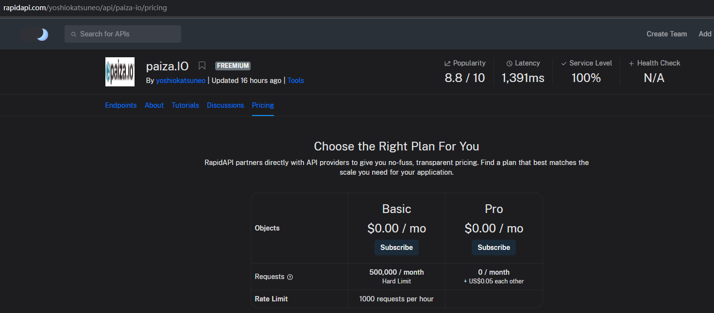

## Next.js 打造一个青少年编程考试模拟系统

### Mini CMS 系统

### 关键功能

1. 在线代码编辑器；
2. 自动执行代码，对比代码来算考试分；
3. 题库系统；
4. 模拟考试系统；
5. dashboard;
6. 考试试题分析；
7. 简单的登录系统；

### 艰难技术点

1. 在线代码编辑器
   https://github.com/Samyc2002/React-IDE
   https://github.com/Vishal-raj-1/code_deck
   https://github.com/devansh016/Cloud-IDE
   https://github.com/kallefrombosnia/amxx-online
   https://github.com/Ajeet1606/code_crushed
   https://github.com/Kshitiz1403/Collaborative-IDE
   https://github.com/souravrax/codeditor-front
   另外参考：
   https://github.com/judge0/judge0 远程代码运行项目 https://judge0.com/#pricing
   https://rapidapi.com/judge0-official/api/judge0-ce/pricing 接口请求平台
   https://github.com/michaelliao/remote-code-runner 类似于在本机执行 cmd 命令，将 output 返回，可以不参考了。
   https://github.com/zakariamaaraki/RemoteCodeCompiler 类似于在本机执行 cmd 命令，将 output 返回，可以不参考了。
   https://cloud.tencent.com/developer/article/2116163

2. vercel 部署
   https://vercel.com/templates/next.js
   https://nextjs.org/

3.CMS 系统
https://vercel.com/templates/next.js/nextjs-blog-with-microcms
https://vercel.com/templates/next.js/blog-agility-cms-nextjs

3. 其他收获
   https://github.com/asciinema/asciinema
   itermal 录屏

https://www.w3cschool.cn/python3/python3-tutorial.html
https://123.w3cschool.cn/webtools 工具网站

### 开发日志

#### 2024.3.5

主要搜索技术难点的解决方案。
在线代码编辑器，基本是：前端收集代码字符串，传输给后端服务进行运行，然后返回运行结果给前端，前端根据结果来进行显示。

#### 2024.3.6

测试本地部署第一个在线编辑器方案；
https://github.com/Samyc2002/React-IDE

这个方案也是，前端 react app，react-code-mirror 组件配置，加 paika.io.rapidapi.com 做服务端来解析代码

测试本地部署第二个在线编辑器方案；
https://github.com/Vishal-raj-1/code_deck
这个方案也是，前端 react app，react-code-mirror 组件配置，加 jugde0.io.rapidapi.com 做服务端来解析代码

测试本地部署第三个在线编辑器方案；
https://github.com/devansh016/Cloud-IDE
这个方案也是，前端 native javascript, texteditor 组件配置，用 node express 起前端服务，代码 runner 也是用 jugde0.io.rapidapi.com 做服务端来解析代码

测试本地部署第四个在线编辑器方案；
https://github.com/kallefrombosnia/amxx-online
框架设计不对，前端服务 node express 起个服务，然后还用到了 exe 执行程序，经测试跑不起来。

测试本地部署第五个在线编辑器方案；
https://github.com/Ajeet1606/code_crushed
框架是理想中的，前端 react + monoca editor,后端用的 jugde0, 算是比较理想的了。 界面要稍调整一下，然后，代码编写时要加一些 snippet

https://github.com/Kshitiz1403/Collaborative-IDE
这个是全栈的,很有借鉴意义，但现在不太适合用它，因为它可能太过复杂，而且依赖于运行主机要安装多种语言的运行容器

https://github.com/souravrax/codeditor-front 只参考前端的就好，后端暂时先不管
https://codeditorproject.web.app/

最后理想方案，参考第五个方案就可以。

#### CMS 方案

headless cms
https://aws.amazon.com/cn/what-is/headless-cms/
https://vercel.com/guides/integrating-next-js-and-contentful-for-your-headless-cms
https://www.contentful.com/pricing/
国内不能用
https://docs.strapi.io/dev-docs/intro
github 上星最高，支持你私有化部署
参考
https://github.com/QingdaoU/OnlineJudge
https://qduoj.com/problem/1
选中的是 strapi，现在要做提熟悉 strapi，并参与到 strapi 项目的开源社区中；
https://juejin.cn/post/7193538722141306917?from=search-suggest

#### 2024.3.13

主体技术栈：
next.js 用来做应用
strapi 用来做 cms ，主要是内容管理
react + monoca editor 作代码编辑器
judge0 用来做代码执行器

部署方案：
cms 系统部署：云主机 docker 部署 strapi，方案暂时不清楚，需要打通 github 自动push后自动触发部署；
next.js 应用部署，可以借用 vercel 云服务，如果不行，就需要在云主机上部署；
注册 judge0 账号；
选云主机厂商；
构建部署流水线打造；

待办事项：

1. 需求分析，开始设计系统原型；
2. 架构设计，领域划分；
3. 实体建模；
4. strapi cms 层 content collection type 创建；
5. 应用开发；
6. 应用测试；
7. 应用部署；
8. 应用上线；

https://www.ciitpc.com/checkpaper?id=1710747445841&title=2022%20%E7%BB%83%E4%B9%A0%E9%A2%98%E5%BA%93%20%E5%9B%9B%E7%BA%A7c%2B%2B%20%E6%A8%A1%E6%8B%9F%E8%AF%95%E5%8D%B71%EF%BC%88%E7%90%86%E8%AE%BA%EF%BC%8B%E7%BC%96%E7%A8%8B%EF%BC%89&realname=%E9%83%AD%E5%B4%87%E5%8F%B0&user_id=1749611557893894145

https://run.w3cschool.cn/tryio/cgi-bin/run

https://www.ciitpc.com/scratch3/index.html

## Next.js App Router Course - Starter

This is the starter template for the Next.js App Router Course. It contains the starting code for the dashboard application.

For more information, see the [course curriculum](https://nextjs.org/learn) on the Next.js Website.

#### 2024.4.8
整理代码
整理 mock 数据
整理类型定义
优化试卷页面

#### 2024.4.9
做完试题的增删改查 4T
 

#### 2024.4.10
做完试卷的增删改查 4T

#### 2024.4.11
做完测试记录的增改查 4T

#### 2024.4.12
做完订单记录的增改查 4T

#### 2024.4.13
做完用户记录的增改查 4T

#### 2024.4.14
完成用户管理及权限控制 4T
